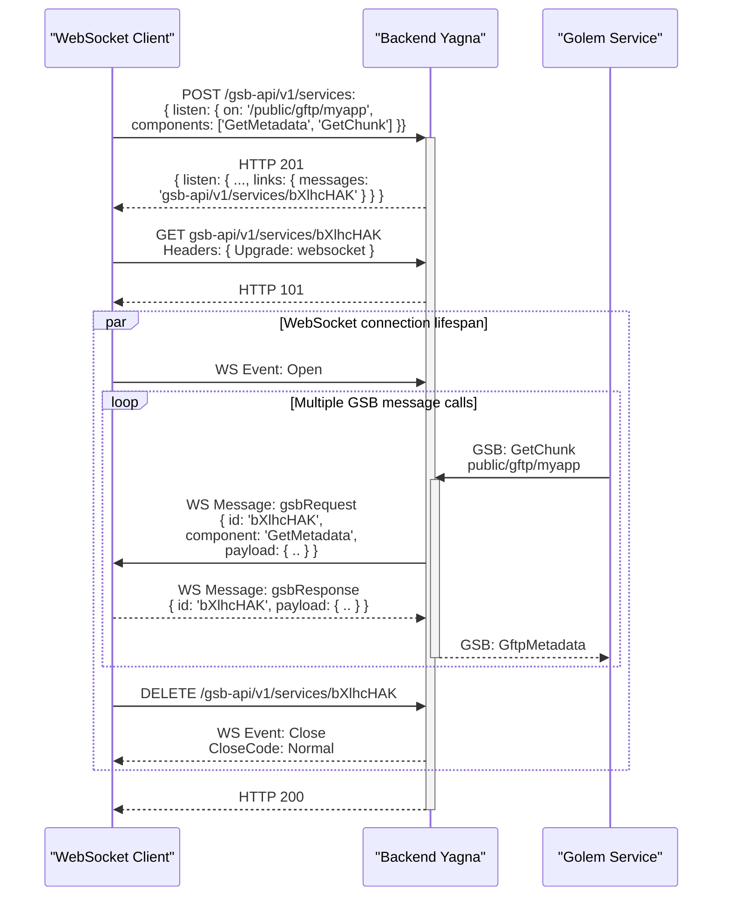
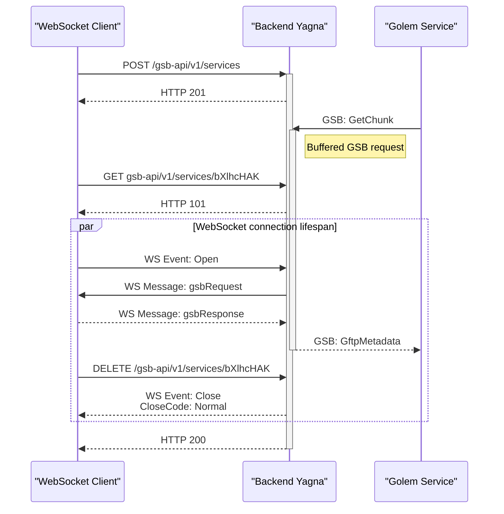
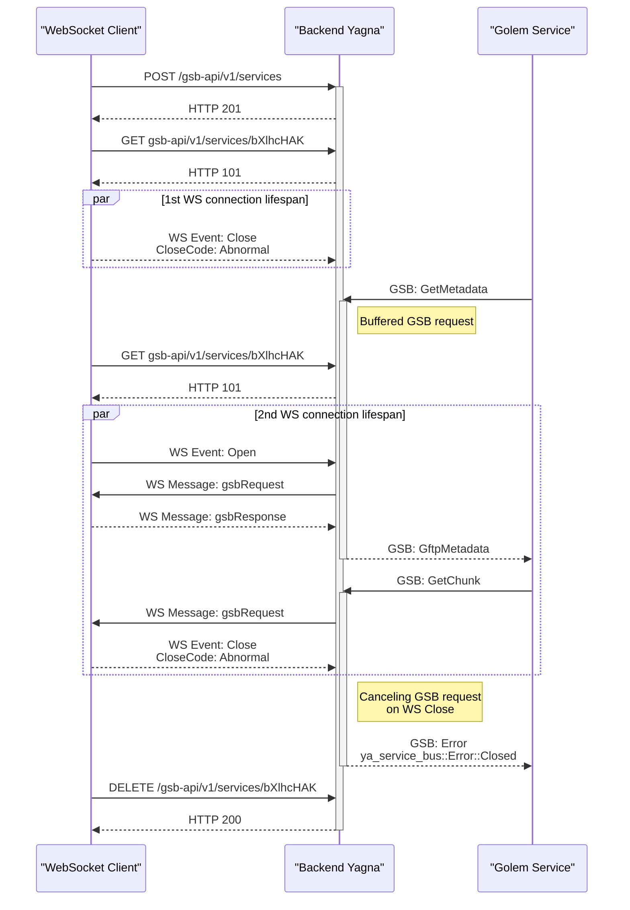

## Yagna public API
Public Yagna REST APIs client binding with Data Model and specifications in [OpenAPI](http://spec.openapis.org/) format.

### Some of GSB API scenarios

#### Basic scenario

#### Early GSB request scenario

#### Some error scenarios (simplified)

