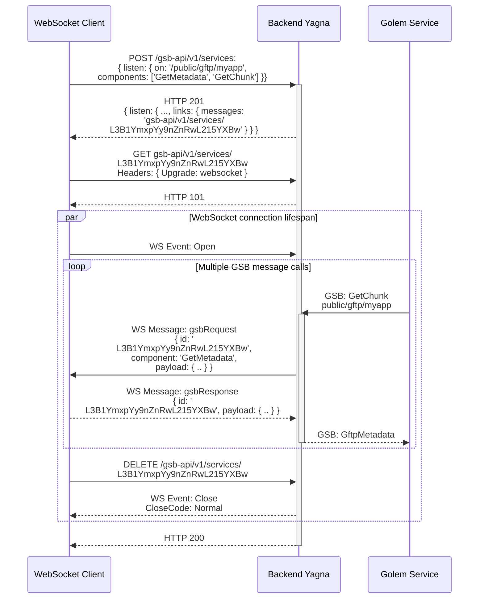
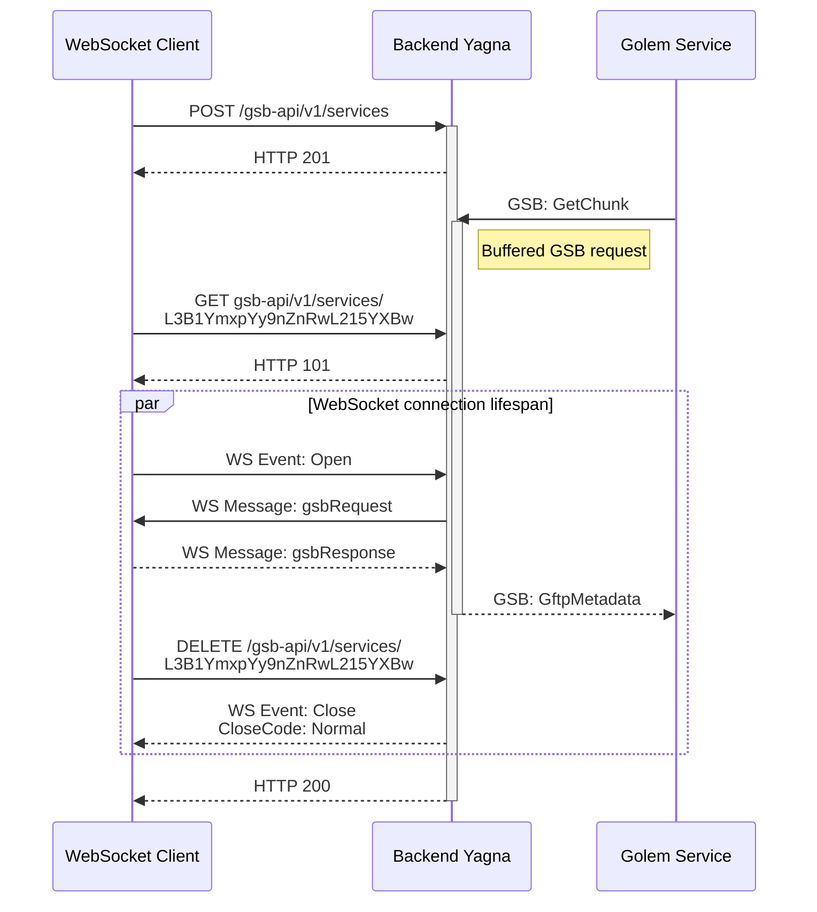
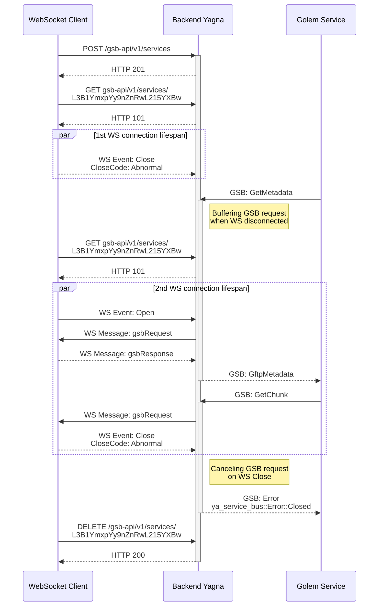
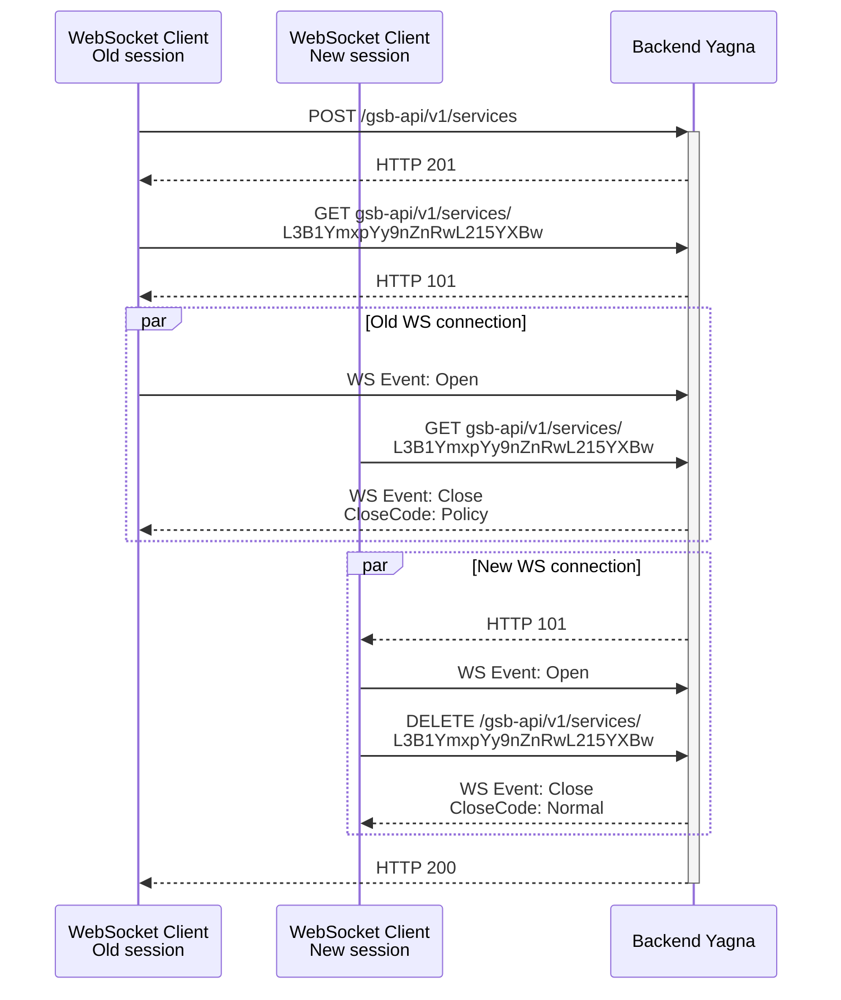

# GSB API

GSB REST API allows to bind and unbind GSB services.

Binding GSB service enables WebSocket endpoint which allows to listen on incoming GSB messages.
Path to WebSocket endpoint is returned in bind service response.

API documentation:

- REST endpoints OpenAPI [schema](../specs/gsb-api.yaml).

- WS AsyncAPI [schema](../specs/gsb-api-messages.yaml).

  Open it directly or by using AsyncAPI Studio.

  `docker run -it -p 8000:80 asyncapi/studio`

## Sample GSB API usage scenarios

### Basic scenario

### Early GSB request scenario (simplified)

#### GSB messages buffering and cancelling (simplified)

### Disconnect WS on new WS connection (simplified)

